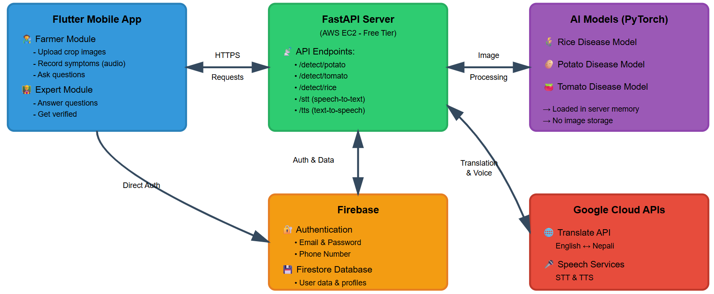
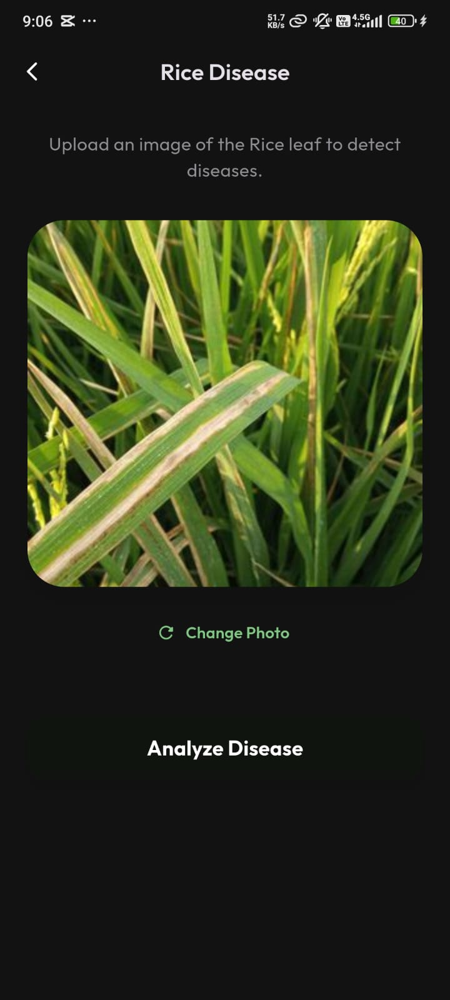
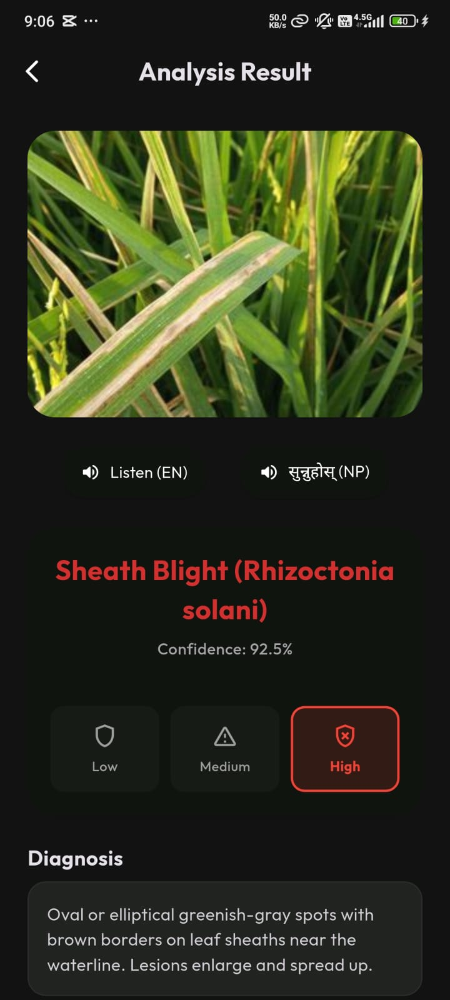
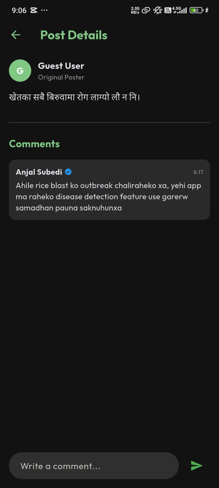
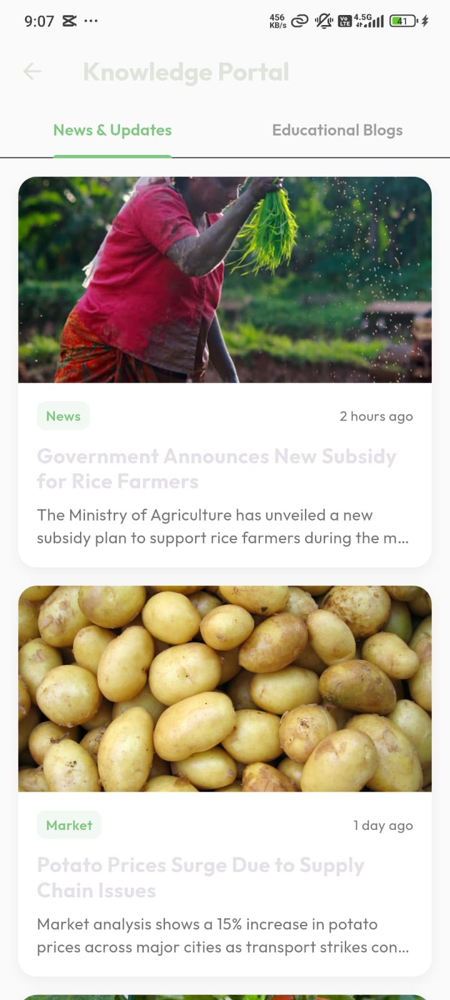
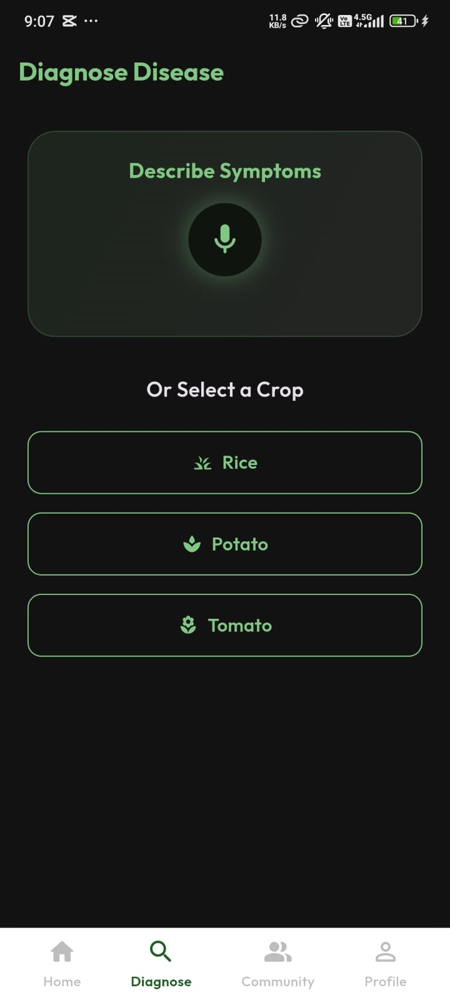

# SajiloKheti

SajiloKheti is an agricultural assistant application built to assist farmers in detecting crop diseases, managing farming activities, and connecting with experts.

## Features

### Disease Detection
- **Visual Diagnosis**: Uses image recognition to detect diseases in Rice, Potato, and Tomato crops.
- **Audio Diagnosis**: Voice-to-Text capability allowing users to describe symptoms for preliminary diagnosis.
- **Detailed Reports**: Provides disease identification, confidence scores, symptoms, causes, and treatment recommendations.

### Expert Verification
- **Verification System**: Allows agricultural experts to apply for verification using professional credentials.
- **Admin Dashboard**: Dedicated interface for administrators to review and approve verification requests.
- **Trusted Experts**: Verified status for legitimate experts to build trust within the community.

### Community & Portal
- **Q&A Forum**: Platform for farmers to post questions and share images.
- **Knowledge Base**: Centralized portal for browsing crop disease information and guidelines.
- **Expert Interaction**: Direct engagement between farmers and verified experts.

### Localization
- **Multi-language Support**: The application is localized for English and Nepali to support regional users.

## Technology Stack

### Mobile Application
- **Framework**: Flutter
- **State Management**: Provider
- **Localization**: flutter_localizations (ARB)
- **Audio**: `record` package
- **Networking**: `http` package

### Backend & Services
- **API**: Python (FastAPI/Flask)
- **Database**: Firebase Firestore
- **Authentication**: Firebase Auth (Email, Phone, Anonymous)
- **Machine Learning**: Custom trained models

## System Architecture


## Project Structure

- `android/`: Android native configuration and code.
- `assets/`: Static assets including images and ML models.
- `backend/`: Python backend API, scripts, and model serving.
- `lib/`: Main Flutter application source code.
  - `l10n/`: Localization files.
  - `models/`: Data models.
  - `providers/`: State management.
  - `screens/`: Application screens (UI).
  - `services/`: External service integrations (API, Firebase).
  - `widgets/`: Reusable UI components.

## Setup and Installation

### Prerequisites
- Flutter SDK
- Python 3.x
- Firebase Project

### Application Setup
1. Clone the repository.
   ```bash
   git clone https://github.com/AnjalSubedi/AgroMind.git
   ```
2. Install Flutter dependencies.
   ```bash
   flutter pub get
   ```
3. Run the application.
   ```bash
   flutter run
   ```

### Backend Setup
1. Navigate to the backend directory.
2. Install requirements.
   ```bash
   pip install -r backend/requirements.txt
   ```
3. Start the server.
   ```bash
   python backend/main.py
   ```

## AWS EC2 Deployment

### Prerequisites
- Amazon Linux 2023 instance (t2.medium or larger)
- Security Group: Allow SSH (22) and TCP (8000)

### Quick Setup

1. **SSH into your instance**
```bash
   ssh -i your-key.pem ec2-user@<your-ec2-ip>
```

2. **Clone and setup**
```bash
   git clone https://github.com/AnjalSubedi/AgroMind.git
   cd AgroMind/backend
   chmod +x setup_ec2.sh
   ./setup_ec2.sh
```

3. **Run as service (optional - for auto-restart)**
```bash
   sudo cp AgroMind.service /etc/systemd/system/
   sudo systemctl daemon-reload
   sudo systemctl enable --now AgroMind
```

4. **Access your API**
```
   http://<your-ec2-ip>:8000
```

## App Screenshots

<p align="center">
  
  
</p>

<p align="center">
  
  
</p>

<p align="center">
  
  
</p>

<p align="center">
  
</p>

## Contributing
Pull requests are welcome. For major changes, please open an issue first to discuss what you would like to change.

## License
MIT
